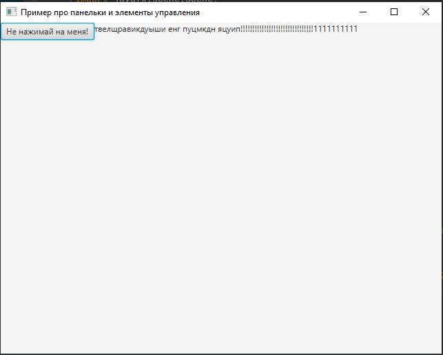

# формулировка задания

## Про кнопку
1. Возьмите программу ListenersExamples. Кроме кнопки добавьте на окно метку (Label). Пусть текст появляется не через sout, а на метке.
1. Пусть меняется текст:

   1. Не нажимай больше на эту кнопку
   2. Я просил, не нажимай больше на эту кнопку
   3. сами
   3. сами. сами придумайте, что говорит кнопка
3. Когда терпение у кнопки кончится, надо удалить все элементы из окна, добавить ImageView и показать на нем gif со взрывом. Или что-то еще.
# внешний вид

  